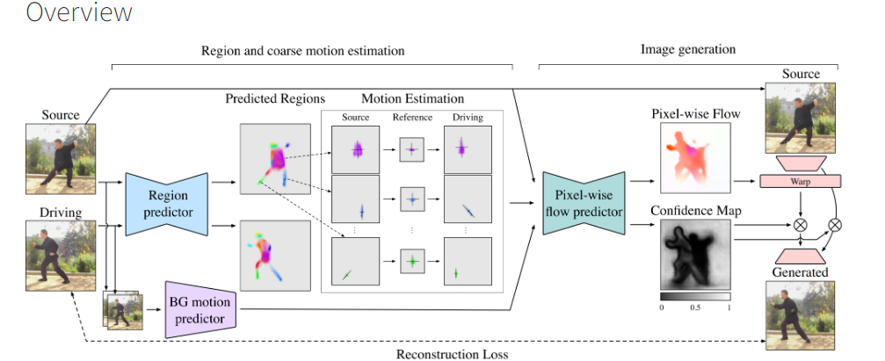
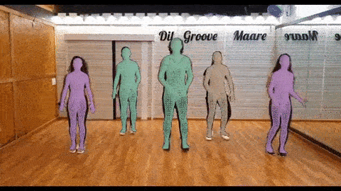
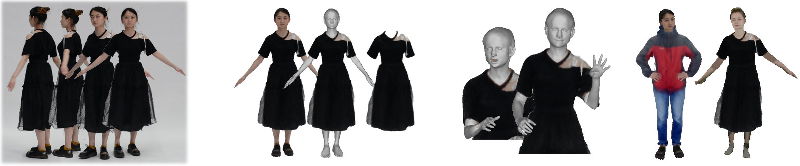
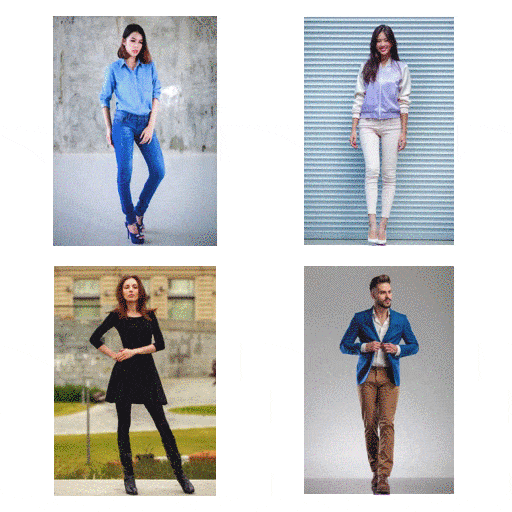

### [计算机图形学书单](https://github.com/HW140701/Book-list-of-computational-geometry-and-computer-graphics)

包括建模以及3D处理

#  面部重演

### [Thin-Plate Spline Motion Model for Image Animation](https://github.com/yoyo-nb/Thin-Plate-Spline-Motion-Model)

这个是清华的面部重演

#  3D人脸建模

### pytorch_fitting_3DMM

[pytorch拟合3DMM](https://github.com/ascust/3DMM-Fitting-Pytorch)

### 3D人脸建模

**[Deep3DFaceReconstruction](https://github.com/microsoft/Deep3DFaceReconstruction)**

**[Deep3DFaceReconstruction 的官网pytorch版本](https://github.com/sicxu/Deep3DFaceRecon_pytorch)**

==============================================

https://github.com/sicxu/Deep3DFaceRecon_pytorch/issues/12

**[别人修改的能够使用pytorch3d训练的版本](https://github.com/xingmimfl/Deep3DFaceRecon_pytorch)**

=============================================

#### 3D人脸建模

###  [EG3D: Efficient Geometry-aware 3D Generative Adversarial Networks](https://nvlabs.github.io/eg3d/)

### 3. 人体动画合成Motion Representations for Articulated Animation

https://github.com/snap-research/articulated-animation

### [VIBE：人体姿势和形状估计的视频推理 [CVPR-2020]](https://github.com/mkocabas/VIBE)

# 三 3D全身重建

## [SCARF：单目视频中人体和服装的捕获和动画](https://github.com/YadiraF/SCARF)

###  [FaceBook的3D人体重建:PIFuHD: Multi-Level Pixel-Aligned Implicit Function for High-Resolution 3D Human Digitization](https://shunsukesaito.github.io/PIFuHD/)

###  [FrankMocap：强大且易于使用的单视图 3D 手+身体姿势估计器](https://github.com/facebookresearch/frankmocap)

###  [TEACH: Temporal Action Composition for 3D Humans](https://github.com/athn-nik/teach) 

使用语言驱动生成3D人体

### 

### uv贴图代码

###  1. [Differentiable Stereopsis: Meshes from multiple views using differentiable rendering](https://github.com/shubham-goel/ds)

### 2.[opengl 教材uv贴图](https://github.com/js-duan/texture_map)

**根据相机坐标和世界坐标求相机位姿**

https://blog.csdn.net/Kalenee/article/details/99207102

