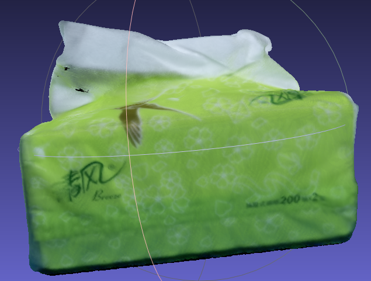

### [计算机图形学书单](https://github.com/HW140701/Book-list-of-computational-geometry-and-computer-graphics)

包括建模以及3D处理

### 1. pytorch_fitting_3DMM

[pytorch拟合3DMM](https://github.com/ascust/3DMM-Fitting-Pytorch)

### 2.   3D人脸建模

**[Deep3DFaceReconstruction](https://github.com/microsoft/Deep3DFaceReconstruction)**

**[Deep3DFaceReconstruction 的官网pytorch版本](https://github.com/sicxu/Deep3DFaceRecon_pytorch)**

==============================================

https://github.com/sicxu/Deep3DFaceRecon_pytorch/issues/12

**[别人修改的能够使用pytorch3d训练的版本](https://github.com/xingmimfl/Deep3DFaceRecon_pytorch)**

=============================================

### 3. 人体动画合成Motion Representations for Articulated Animation
https://github.com/snap-research/articulated-animation

### 1. [VIBE：人体姿势和形状估计的视频推理 [CVPR-2020]](https://github.com/mkocabas/VIBE)

## 2.[SCARF：单目视频中人体和服装的捕获和动画](https://github.com/YadiraF/SCARF)

### 3. [FaceBook的3D人体重建](https://shunsukesaito.github.io/PIFuHD/)

###  4.[FrankMocap：强大且易于使用的单视图 3D 手+身体姿势估计器](https://github.com/facebookresearch/frankmocap)

### 5. [TEACH: Temporal Action Composition for 3D Humans](https://github.com/athn-nik/teach) 

### uv贴图代码

###  1. [Differentiable Stereopsis: Meshes from multiple views using differentiable rendering](https://github.com/shubham-goel/ds)

### 2.[opengl 教材uv贴图](https://github.com/js-duan/texture_map)

**根据相机坐标和世界坐标求相机位姿**

https://blog.csdn.net/Kalenee/article/details/99207102

